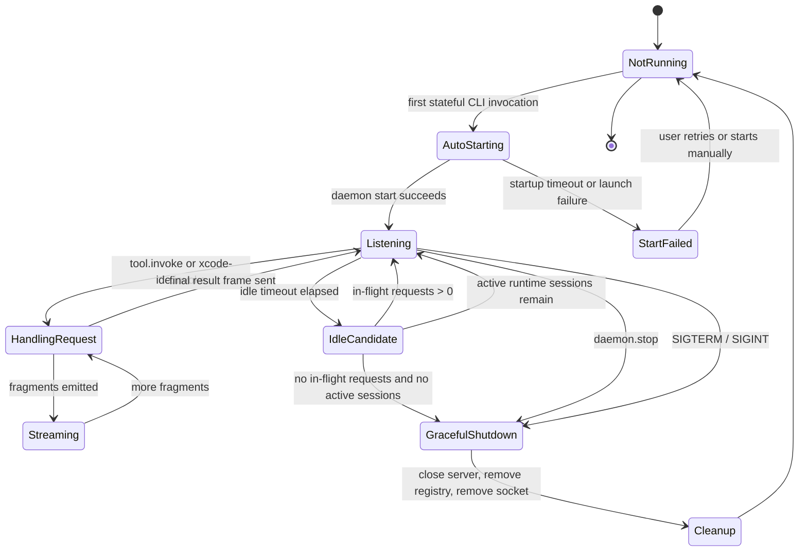

import { PageHeader } from "../_components/page-header"

<PageHeader
  breadcrumbs={["Docs", "Contributing", "Architecture", "Daemon Lifecycle"]}
  title="Daemon Lifecycle"
  lede="Why XcodeBuildMCP keeps one small background process per workspace for tool work that needs state after the shell command exits, and how that process starts, runs, and shuts down."
/>

Some tool work has to outlive the shell command that started it — an active debug session, an in-progress video capture, an open Xcode bridge. The CLI process exits as soon as the shell command finishes, so that state has nowhere to live. This page is about the per-workspace background process that owns that kind of work, and the lifecycle that decides when it starts, what it owns, and when it shuts down.

## Terms used here

See the full glossary at [Core terms](/docs/architecture#core-terms).

- **daemon** — The workspace-scoped background process (`xcodebuildmcp daemon`) that owns stateful tool work — debug sessions, video captures, long-running SwiftPM work, the Xcode IDE bridge — across short-lived CLI commands.
- **transport** — The wire a request travels on; for the daemon, that is a Unix socket scoped to the workspace.
- **tool handler** — The shared function the daemon hosts on behalf of stateful tools; the same function the in-process CLI would have called.
- **workspace root** — The project root that owns configuration and daemon state, used to derive a stable key for the daemon socket.

## Why the daemon exists

CLI processes are short-lived. That is good for scripts, but bad for work that needs state after the command exits. Debug sessions, video recording, background Swift Package work, log capture, and the Xcode IDE bridge all need an owner that survives one shell command.

The daemon is that owner. The CLI still provides the user-facing command surface and output mode. The daemon owns stateful execution, streams fragments back to the CLI, and returns final structured output when the tool finishes or the stateful action reaches its response boundary.

## Lifecycle



## Workspace scoping

Each daemon is scoped to one workspace. XcodeBuildMCP derives the workspace identity from the project config location when `.xcodebuildmcp/config.yaml` exists. Otherwise it uses the current directory. That workspace root becomes a stable key for the daemon socket path.

| Concept | Meaning |
|---------|---------|
| Workspace root | The project root that owns config and daemon state. |
| Workspace key | A stable derived key used to separate daemon instances. |
| Socket path | The local Unix socket the CLI uses to talk to that workspace daemon. |

This avoids sharing debugger state, video sessions, or bridge state across unrelated projects.

## Startup and routing

A tool opts into daemon routing through manifest routing metadata. When the CLI invokes a stateful tool, the invoker checks whether the workspace daemon is already running. If it is not, the invoker starts it, waits for the socket, and then sends the tool invocation over the daemon protocol.

The user-facing command does not change:

```shell
xcodebuildmcp simulator record-video --simulator-id <UDID> --output-path ./session.mp4
```

The routing choice is internal. The shell still sees CLI output in the requested mode.

## Protocol shape

The daemon protocol has two jobs:

1. Forward progress fragments back to the CLI while the daemon-owned handler runs.
2. Return the final structured output and next-step data when the invocation reaches a response boundary.

That mirrors direct CLI invocation. The difference is process ownership: direct tools run in the CLI process, daemon-routed tools run in the workspace daemon and stream events back to the CLI client.

## Idle shutdown

The default idle timeout is 10 minutes. It can be overridden with `XCODEBUILDMCP_DAEMON_IDLE_TIMEOUT_MS`.

The daemon shuts down only when all of these are true:

| Gate | Why it matters |
|------|----------------|
| Idle timeout elapsed | Avoids stopping immediately between related commands. |
| No in-flight requests | Avoids killing an active invocation before it sends its final frame. |
| No active runtime sessions | Avoids killing stateful sessions that still own work. |

This is stricter than just checking for an empty session list. It protects both active protocol requests and longer-lived runtime sessions.

## Manual control

The CLI exposes daemon commands for inspection and recovery:

```shell
xcodebuildmcp daemon status
xcodebuildmcp daemon start
xcodebuildmcp daemon stop
xcodebuildmcp daemon restart
xcodebuildmcp daemon list
xcodebuildmcp daemon logs
```

Use manual control for debugging. Normal stateful tool calls auto-start the daemon and do not require setup.

## Related

- [CLI](/docs/cli#per-workspace-daemon), user-facing daemon behavior
- [Environment Variables](/docs/env-vars), daemon and startup overrides
- [Troubleshooting](/docs/troubleshooting), common local failures
- [Runtime Boundaries](/docs/architecture-runtime-boundaries#direct-vs-daemon-routed-tools), why daemon routing belongs to CLI
