import { PageHeader } from "../_components/page-header"

<PageHeader
  breadcrumbs={["Docs", "Contributing", "Architecture", "Manifests & Visibility"]}
  title="Manifests & Visibility"
  lede="How XcodeBuildMCP describes its tools as data instead of code, and how it decides which front door advertises each one in any given session."
/>

XcodeBuildMCP's MCP server, CLI, and daemon all need to know the same things about a tool — its protocol name, command name, description, output schema, and the conditions under which it should be visible. This page covers the two layers that handle that: the YAML files that declare tools, workflows, and resources without containing implementation code, and the rules that decide which of those declarations actually reach the caller.

## Terms used here

- **manifest** — A YAML file under `manifests/` that declares a tool, workflow, or resource as metadata, without containing the implementation. Example: `manifests/tools/list_sims.yaml` declares the `list_sims` tool's MCP and CLI names and its output schema reference, while the implementation lives separately in `src/mcp/tools/simulator/list_sims.ts`.
- **workflow** — A named group of related tools (such as simulator, device, or debugging) that callers can opt into so the advertised catalog stays small.
- **predicate** — A named runtime check that decides whether a manifest entry is eligible for the current process. Example: a tool tagged with the `debugEnabled` predicate stays hidden unless debug mode was enabled at startup.
- **exposure** — The final decision to advertise a tool or resource on a runtime, after workflow selection, predicates, and availability checks have all agreed. Example: `list_sims` is exposed on MCP only when the simulator workflow is selected, every predicate on the manifest passes, and `availability.mcp` is `true`.
- **availability** — A manifest field that declares whether a tool can be exposed on MCP, CLI, or both.

For the canonical glossary, see [Core terms](/docs/architecture#core-terms).

## Why metadata lives in manifests

Tool metadata is consumed by more than one boundary. MCP registration needs protocol names, annotations, output schemas, and descriptions. CLI registration needs command names, workflow grouping, descriptions, and routing hints. Docs and generated references need the same source of truth.

Keeping that metadata in YAML prevents each runtime from inventing its own catalog. The implementation file stays focused on input validation and work execution. The manifest explains how that implementation is exposed.

## Manifest roles

| Directory | Defines | Used by |
|-----------|---------|---------|
| `manifests/tools/` | Tool ID, implementation module, MCP and CLI names, description, annotations, availability, predicates, routing, next steps, output schema metadata. | MCP registration, CLI command generation, daemon catalog, generated docs, schema checks. |
| `manifests/workflows/` | Workflow ID and tool membership. | Workflow selection, sidebar grouping in generated references, MCP catalog trimming. |
| `manifests/resources/` | MCP resource metadata and module handler. | MCP resource registration. |

Tool modules are imported only after the manifest has been loaded and filtered. A tool module must export named `schema` and `handler` values. Resource modules have their own contract and require a handler, so avoid treating the tool-module contract as universal.

## Load, validate, import

```mermaid
flowchart LR
    ToolsYaml["manifests/tools/*.yaml"]
    WorkflowsYaml["manifests/workflows/*.yaml"]
    ResourcesYaml["manifests/resources/*.yaml"]

    ToolsYaml --> Load["loadYamlFiles()"]
    WorkflowsYaml --> Load
    ResourcesYaml --> Load

    Load --> Zod["Zod validation<br/>schema.ts"]
    Zod --> PredicateCheck["Validate predicate names<br/>predicate-registry.ts"]
    PredicateCheck --> RefCheck["Validate references<br/>workflow tools + next-step toolIds"]
    RefCheck --> Manifest["ResolvedManifest<br/>tools + workflows + resources"]

    Manifest --> Select["Runtime selection<br/>MCP requested/default/auto workflows"]
    Select --> Exposure["Exposure filtering<br/>availability + predicates"]
    Exposure --> Import["importToolModule(module)"]
    Import --> NamedExports["Require named exports<br/>schema + handler"]
    NamedExports --> ToolDefs["ToolDefinition[]"]

    ToolDefs --> MCPCatalog["MCP registry catalog"]
    ToolDefs --> CLICatalog["CLI command catalog"]
    ToolDefs --> DaemonCatalog["Daemon catalog"]
```

Validation happens before runtime exposure. The loader validates YAML shape, predicate names, workflow tool references, next-step tool references, and duplicate MCP names. Runtime catalog builders should be able to assume they are working from a coherent manifest graph.

## Visibility layers

Visibility is deliberately layered. Each layer answers a different question.

| Layer | Question | Example |
|-------|----------|---------|
| Workflow selection | Which group of tools did the session ask for? | Default MCP exposure starts from the simulator workflow to keep agent context small. |
| Predicate filtering | Is this entry valid for the current runtime config? | Experimental workflow discovery appears only when its predicate passes. |
| Runtime availability | Is the entry available to MCP, CLI, or both? | A manifest can expose a tool to MCP, CLI, or both. |
| Daemon exposure | Should the daemon serve this stateful CLI call? | Daemon exposure is derived from CLI routing, not declared as a manifest availability flag. |

Do not add a third manifest availability mode for daemon behavior. The daemon is a transport for stateful CLI tools, not a public runtime selector like MCP or CLI.

## Workflow selection before predicates

Workflow selection is the coarse catalog control. It keeps MCP sessions small and lets users enable only the capability groups they need. Predicate filtering is finer grained. It can hide tools that require debug mode, experimental workflow discovery, or a runtime environment that is not currently active.

That order matters for contributors. Put durable product grouping in workflow manifests. Put conditional exposure in predicates. Put public runtime support in the `availability` object.

## Authoring implications

When adding or changing a tool, update the manifest first enough to make the intended exposure explicit:

- Add the tool manifest once, even if multiple workflows reference it.
- Use workflow membership for discoverability and catalog size.
- Use predicates for conditional visibility.
- Use `availability` only for MCP and CLI exposure.
- Use routing metadata for stateful CLI transport.
- Keep manifest output schema metadata aligned with `ctx.structuredOutput`.

See [Tool Authoring](/docs/tool-authoring) for the end-to-end checklist and [Tools Reference](/docs/tools) for the generated catalog.

## Related

- [Workflows](/docs/workflows), user-facing workflow selection
- [Configuration](/docs/configuration), config fields that affect exposure
- [Tool Authoring](/docs/tool-authoring), manifest fields and validation checklist
- [Tools Reference](/docs/tools), generated tool catalog
