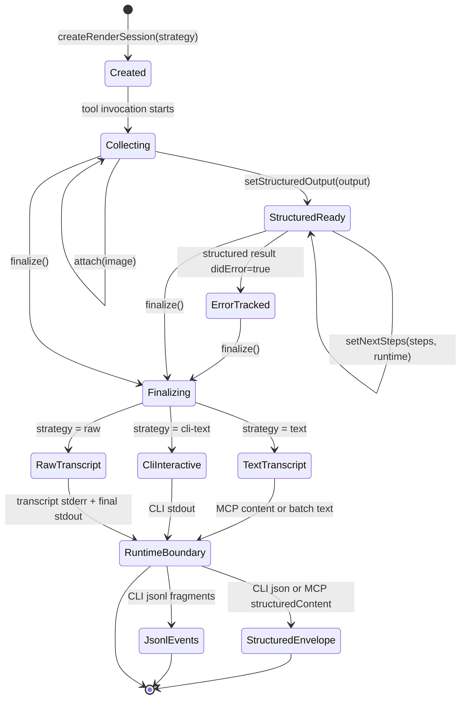

import { PageHeader } from "../_components/page-header"

<PageHeader
  breadcrumbs={["Docs", "Contributing", "Architecture", "Rendering & Output"]}
  title="Rendering & Output"
  lede="How XcodeBuildMCP turns whatever a tool produces into the actual bytes a caller sees — readable text, machine-parseable JSON, streamed events, or raw subprocess transcripts — without making the tool care which."
/>

When a tool finishes, the caller might be a chat agent expecting MCP-formatted text, a developer reading their terminal, a script that wants one JSON object, a pipeline consuming JSONL events, or a debugger watching raw subprocess output. The tool itself does not pick. A separate layer collects everything the tool produced as it ran and turns it into the right shape on the way out. This page covers that layer, and the one naming distinction it forces contributors to keep straight.

## Terms used here

- **rendering** — The step that turns a call's fragments, attachments, next steps, and structured output into MCP text, CLI text, JSON, JSONL, or a raw transcript.
- **render session** — The per-call object that collects fragments and the final structured output as a handler runs, so the runtime boundary can format them appropriately on the way out.
- **render strategy** — Internal: how the render session formats the in-process transcript while the call is running (`text`, `cli-text`, or `raw`). Not selected directly by callers.
- **CLI output mode** — External: what the `xcodebuildmcp` CLI prints to stdout for a given invocation (`text`, `json`, `jsonl`, or `raw`). Selected by the caller via `--output`.
- **fragment** — A typed progress event the handler emits while work runs.
- **structured output** — The final canonical JSON result a handler sets at the end of a call.

For the canonical glossary, see [Core terms](/docs/architecture#core-terms).

## Why rendering is a boundary

Tool handlers produce domain fragments, attachments, next steps, and one final structured result. They should not decide whether a caller wants MCP text, interactive CLI text, raw subprocess transcript, JSON, or JSONL.

The render boundary keeps that decision outside the handler. MCP can return protocol-native content. CLI can stream text for humans, JSONL for pipelines, JSON for scripts, or raw transcript for debugging.

## Render session lifecycle

The render session is the collection point for the tool invocation. It receives fragments as work happens, stores attachments, stores the final structured output, stores next steps, derives error state from the structured result, and finalizes the transcript for the selected render strategy.

## Render strategy vs CLI output mode

These two terms sound similar and are easy to conflate. They are not the same.

A **render strategy** is internal. It is how the render session shapes the in-process transcript as fragments arrive. There are three: `text` (buffered readable text used by MCP and batch CLI output), `cli-text` (streamed human-readable progress to stdout), and `raw` (subprocess-style transcript for debugging). Tool handlers do not choose a strategy; the runtime boundary picks one based on how it intends to deliver output.

A **CLI output mode** is external. It is what the user typed after `--output` on the command line: `text`, `json`, `jsonl`, or `raw`. `--output text` maps to the `cli-text` render strategy, and `--output raw` maps to the `raw` render strategy. The CLI handles `json` and `jsonl` at the boundary (`json` waits for the final structured output and prints one final structured envelope; `jsonl` writes one NDJSON event (newline-delimited JSON) per emitted fragment and never prints the final structured envelope).

Two practical consequences:

- There is no `json` render strategy and no `jsonl` render strategy. Those are CLI output modes handled at the CLI boundary, not inside the render session.
- MCP has no output mode. MCP always returns text content plus, when present, `structuredContent`.

## Render strategies

| Strategy | Used for | Behavior |
|----------|----------|----------|
| `text` | MCP text content and buffered text rendering. | Collects fragments and finalizes a readable transcript. |
| `cli-text` | Interactive CLI text. | Streams human-readable progress to stdout as the tool runs. |
| `raw` | CLI raw mode. | Writes transcript fragments close to the underlying subprocess output and keeps final non-transcript text separate. |

## CLI output modes

CLI output modes decide what the shell receives after or during invocation.

| Mode | Relationship to rendering |
|------|---------------------------|
| `text` | Uses the CLI text render path for readable progress and final text. |
| `json` | Waits for final structured output and prints one final structured envelope. |
| `jsonl` | Writes one NDJSON event per emitted fragment. It does not print the final structured envelope. |
| `raw` | Uses the raw render path for subprocess-oriented debugging. |

For the public shapes, examples, and scripting guidance, see [Output Formats](/docs/output-formats).

## MCP structured content

MCP mode always returns normal text content. When a tool produced structured output, the MCP response also includes `structuredContent` in the same envelope shape used by CLI `--output json`.

That means contributors should treat `ctx.structuredOutput` as the stable contract. Rendered text can change to improve readability. Structured output changes require schema, fixture, and generated-doc alignment.

## Next steps at the render boundary

Next steps are resolved after the handler completes and before final rendering. The runtime decides formatting:

- MCP text gets MCP-appropriate follow-up text.
- CLI text gets command-shaped follow-ups.
- Structured envelopes carry the final result, not a separate rendered transcript.
- JSONL carries live fragments, not the final response.

See [Tool Lifecycle](/docs/architecture-tool-lifecycle#next-step-resolution) for where next-step data comes from.

## Contributor rules

- Do not make handlers branch on CLI versus MCP output mode.
- Set `ctx.structuredOutput` for every tool that has a stable result contract.
- Emit fragments only for live progress, not as the only source of final data.
- Keep manifest output schema metadata aligned with the structured output envelope.
- Update fixtures when public rendering or structured output intentionally changes.

## Related

- [Output Formats](/docs/output-formats), public CLI and MCP response shapes
- [MCP Protocol Support](/docs/mcp-protocol-support), structured content and protocol features
- [CLI](/docs/cli), terminal usage and daemon behavior
- [Tool Lifecycle](/docs/architecture-tool-lifecycle), handler output contract
