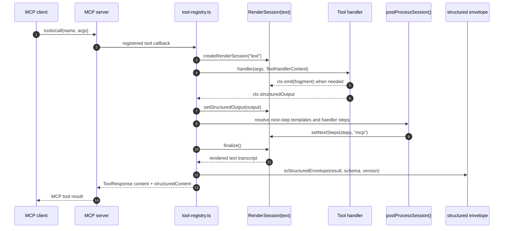
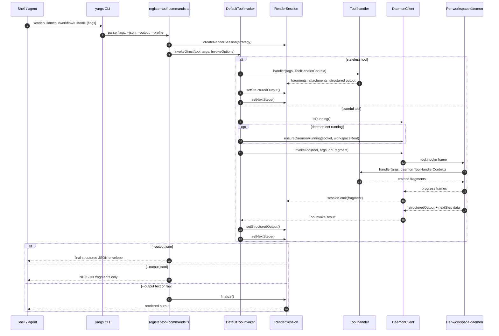

import { PageHeader } from "../_components/page-header"

<PageHeader
  breadcrumbs={["Docs", "Contributing", "Architecture", "Runtime Boundaries"]}
  title="Runtime Boundaries"
  lede="How a request reaches the same Xcode tool whether it arrives through an MCP client, a shell command, or a CLI command that hands work off to the workspace daemon."
/>

A request to do Xcode work can arrive through three different front doors: the MCP server an agent connects to, the `xcodebuildmcp` command run directly in a shell, or that same CLI command quietly handing itself off to a long-running workspace process for stateful work. The three concrete entry points are the MCP stdio server (`xcodebuildmcp mcp`), the in-process CLI (`xcodebuildmcp <workflow> <tool>` running directly in the shell), and the same CLI command routed over a Unix socket to the per-workspace daemon. This page is about those front doors and how each one lines a request up to call the same shared tool function.

## Terms used here

See the full glossary at [Core terms](/docs/architecture#core-terms).

- **runtime boundary** — The adapter where MCP, direct CLI, or daemon-routed CLI translates an incoming request into a call against the shared tool layer.
- **transport** — The wire the request travels on: MCP stdio, in-process CLI invocation, or a Unix-socket connection to the daemon.
- **tool handler** — The shared function that performs the validated action; it does not know which boundary called it.
- **daemon** — A workspace-scoped background process that owns stateful tool work across short-lived CLI commands.
- **workflow** — A named group of related tools, used here to scope which tools the MCP catalog advertises and how CLI tool commands are grouped.

## Why runtime boundaries exist

XcodeBuildMCP has two public entry points, MCP and CLI, because agents and shells have different constraints. The CLI then splits into in-process and daemon-routed execution for stateful work, so contributors maintain three runtime boundary surfaces inside those two public surfaces.

MCP mode optimizes for agent context. It should advertise a small, relevant tool catalog, return MCP-native content, and attach structured results when available. CLI mode optimizes for discovery, scripting, and human debugging. It should expose top-level commands, workflow command groups, output modes, and daemon-backed state for long-running work.

Both boundaries call the same tool handlers.

## Boundary contracts

| Boundary | Entry shape | Primary contract |
|----------|-------------|------------------|
| MCP | `xcodebuildmcp mcp` | Register MCP tools and resources, render text content, attach `structuredContent` when the tool produced structured output. |
| CLI top-level commands | `init`, `setup`, `upgrade`, `tools`, `daemon` | Provide setup, discovery, daemon control, and server startup commands outside the workflow tool tree. |
| CLI tool commands | `xcodebuildmcp <workflow> <tool> [flags]` | Parse flags or JSON input, invoke a catalog tool, and choose a CLI output mode. |
| Daemon-routed CLI | Same CLI tool command shape | Preserve state across short-lived CLI processes for tools that declare stateful routing. |

For user-facing syntax, see [CLI](/docs/cli) and [MCP Server Mode](/docs/mcp-mode).

## MCP boundary

MCP mode starts a stdio server, builds the MCP-visible catalog from enabled workflows, and registers tool callbacks with the MCP SDK. The callback creates a text render session, calls the shared handler, resolves next steps, finalizes text, and returns both MCP `content` and structured content when the handler set a structured result.

The MCP boundary is also where workflow selection matters most. Keeping the advertised catalog small reduces agent context cost. See [Workflows](/docs/workflows) for the public workflow model and [MCP Protocol Support](/docs/mcp-protocol-support) for MCP features exposed at the protocol boundary.

## CLI boundary

The CLI builds a yargs command tree from the same manifest-backed catalog. Non-tool commands are registered as top-level commands. Tool commands are grouped by workflow so `xcodebuildmcp simulator build` and `xcodebuildmcp device install` stay discoverable in shells and scripts.

CLI invocation has one extra decision that MCP mode does not need: whether the tool can run in the current process or needs daemon transport.

## Direct vs daemon-routed tools

Stateless tools run directly in the CLI process. Listing simulators, reading project metadata, and similar short operations do not need background state.

Stateful tools route through the per-workspace daemon. Debug sessions, video recording, long-running Swift Package work, and Xcode IDE bridge calls need process state that outlives one CLI command. The CLI still owns argument parsing and output formatting, but the daemon owns the active session.

See [Daemon Lifecycle](/docs/architecture-daemon) for daemon transport details and [Rendering & Output](/docs/architecture-rendering-output) for how the result is presented after either path completes.

## Related

- [CLI](/docs/cli), direct terminal access and output modes
- [MCP Server Mode](/docs/mcp-mode), server startup and advertised surface
- [MCP Protocol Support](/docs/mcp-protocol-support), MCP feature support
- [Daemon Lifecycle](/docs/architecture-daemon), stateful CLI transport
