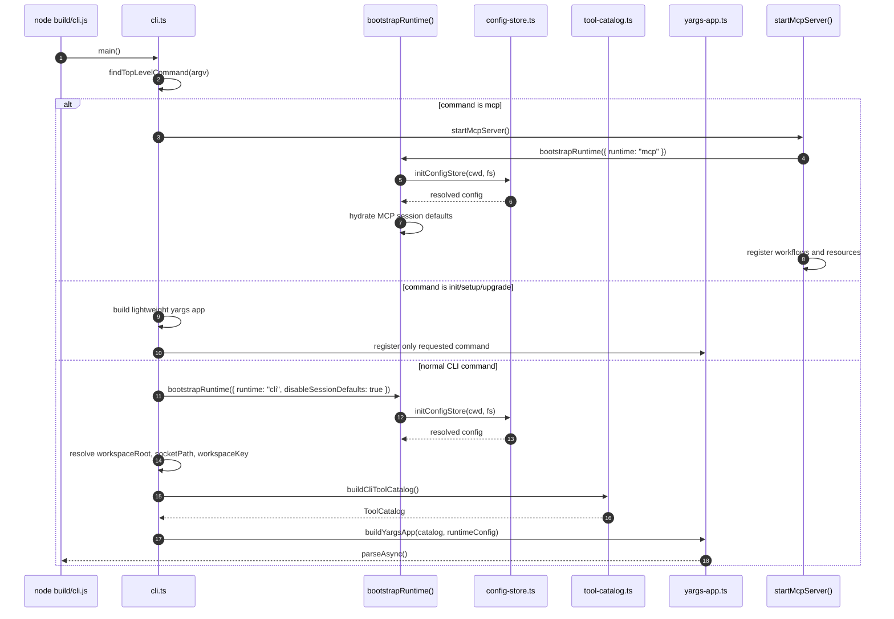
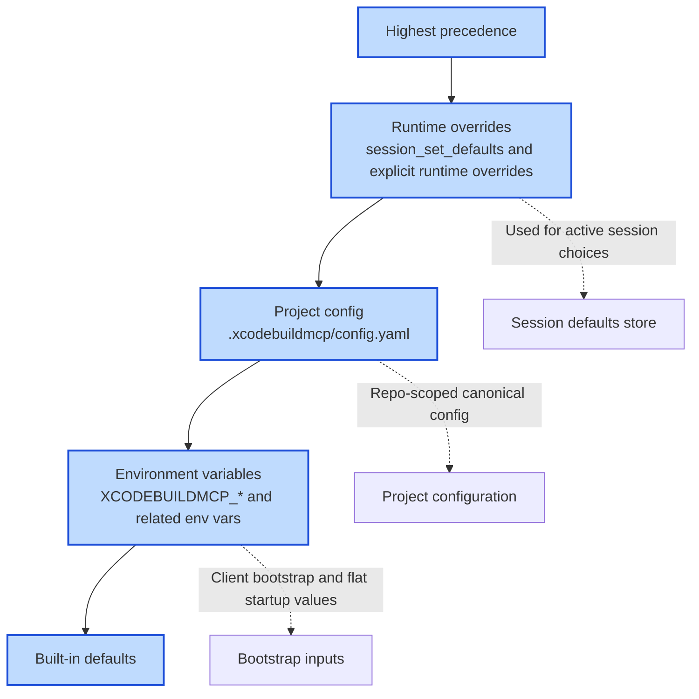

import { PageHeader } from "../_components/page-header"

<PageHeader
  breadcrumbs={["Docs", "Contributing", "Architecture", "Startup & Configuration"]}
  title="Startup & Configuration"
  lede="How a process boots, decides which configuration to apply, and prepares the tools a caller can reach — without making cheap commands pay for the full runtime."
/>

When you run any `xcodebuildmcp` command, the process has to decide how much setup to do before it can answer. Printing a version or running `init` should not load every manifest in the project; the MCP server has to load almost everything because an agent will keep asking. This page is about that decision — what the early bootstrap step does, what each runtime initializes after it, and where configuration values come from.

## Terms used here

See the full glossary at [Core terms](/docs/architecture#core-terms).

- **bootstrap** — The early startup step (`bootstrapRuntime()`) that initializes the project configuration store and, for MCP mode, hydrates session defaults before any tool runs.
- **session-default store** — The MCP-only in-process record of agent-set values (workspace, scheme, simulator, profile) so later tool calls in the same session can omit them.
- **runtime boundary** — The adapter that turns an incoming request into a call against the shared tool layer; this page covers what each boundary loads at startup.
- **workflow** — A named group of related tools; workflow-selection inputs decide which tools the MCP boundary advertises after bootstrap.

## Why startup is split

Not every command needs the full runtime. Setup commands should start quickly and avoid manifest catalog work. MCP mode needs a live session store because agents can set defaults during a session. Normal CLI tool calls are short-lived, so they resolve config for the invocation instead of hydrating the MCP session-default store.

That split keeps command startup predictable while still giving every runtime the same resolved project configuration.

## Startup paths

| Path | Why it is separate | What it initializes |
|------|--------------------|---------------------|
| MCP server | Agents need a persistent server session. | Config store, MCP session defaults, resources, MCP-visible workflows and tools. |
| Lightweight setup commands | They should not pay for catalog construction. | Only the requested top-level command. |
| Normal CLI commands | Scripts need deterministic one-shot execution. | Config store, workspace identity, socket path, CLI catalog, yargs tool tree. |
| Daemon process | Stateful CLI work needs a background owner. | Daemon catalog, socket server, activity tracking, idle shutdown. |

The daemon path is intentionally linked, not duplicated, here. See [Daemon Lifecycle](/docs/architecture-daemon) for transport and shutdown behavior.

## Configuration precedence

Configuration is layered so each source has a clear job. Runtime values win because they represent the active session. Project config is the repo-scoped source of truth. Environment variables are best for MCP clients and process bootstrap.

For the full user-facing schema, see [Configuration](/docs/configuration). For flat environment inputs, see [Environment Variables](/docs/env-vars).

## Session-default hydration

MCP mode hydrates session defaults during bootstrap because the server is long-lived. Once an agent sets workspace, scheme, simulator, or profile values, later tool calls can omit repeated parameters.

CLI mode uses the same config file and profile concepts, but each invocation is a new process. It resolves defaults for that command instead of treating the session-default store as shared process state. That distinction matters when debugging startup: MCP has live in-process defaults, while CLI has deterministic per-command inputs.

See [Session Defaults](/docs/session-defaults) for the public behavior and [Workflows](/docs/workflows) for the workflow-selection inputs that influence the advertised catalog.

## Design rules for contributors

- Keep early commands lightweight unless they genuinely need the runtime catalog.
- Keep config precedence visible. Hidden fallback behavior makes agent sessions hard to reason about.
- Put persistent state in the daemon, not in a short-lived CLI process.
- Treat MCP session defaults as MCP runtime state, not as a global source that every boundary must hydrate.

## Related

- [Configuration](/docs/configuration), config file and precedence
- [Session Defaults](/docs/session-defaults), shared workspace, scheme, simulator, and profile values
- [Environment Variables](/docs/env-vars), process bootstrap inputs
- [Workflows](/docs/workflows), enabled workflow selection
