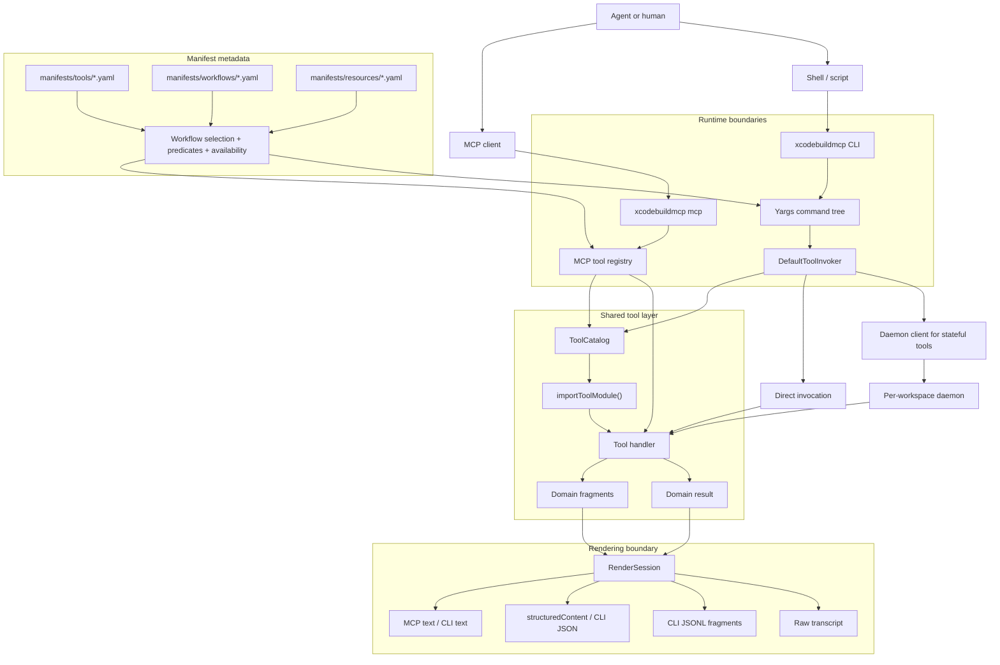

import { PageHeader } from "../_components/page-header"

<PageHeader
  breadcrumbs={["Docs", "Contributing", "Architecture"]}
  title="Architecture Overview"
  lede="How an agent or shell command becomes an Xcode action, and how XcodeBuildMCP keeps that behavior shared across MCP, CLI, and long-running background work."
/>

XcodeBuildMCP is one project that does Xcode work — building, running, debugging, simulator and device control, UI automation, scaffolding — and exposes that work through several front doors at once. AI agents reach it over the Model Context Protocol. Humans and scripts reach it through a `xcodebuildmcp` command-line tool. Some commands need state that has to outlive a single shell process, so they hand work off to a background process scoped to the project workspace.

All three paths run the same implementation. This page is the entry point to how that shared implementation is organized. Read it once before the architecture subpages — it defines the vocabulary the rest of the section uses.

## Core terms

These are the canonical terms used throughout the architecture docs. Every other architecture page links back here on first use.

- **workflow** — A named group of related Xcode tools (for example, simulator, device, debugging, project scaffolding) that contributors curate together so callers can opt into a small, relevant slice of the catalog.
- **manifest** — A YAML file under `manifests/` that declares a tool, workflow, or resource as metadata — name, description, schema reference, visibility rules — without containing the implementation code.
- **predicate** — A named runtime check (such as "Xcode is installed" or "running on Apple Silicon") that decides whether a manifest entry is eligible for the current process.
- **availability** — A field on a tool manifest declaring which runtimes (MCP, CLI, or both) may advertise the tool, while daemon exposure is derived from routing metadata rather than declared here.
- **exposure** — The final decision to advertise a tool or resource on a given runtime, after workflow selection, predicates, and availability checks have all agreed.
- **runtime boundary** — The adapter layer where a request enters the system — through the Model Context Protocol (MCP) server, the local CLI, or a CLI command routed to the daemon — and is translated into a call against the shared tool layer.
- **tool handler** — The function inside a tool module that performs one validated action and writes its outcome onto the call context; everything user-visible is downstream of it.
- **fragment** — A typed progress event that a handler emits while work is still running, such as a log line, a transcript chunk, or an attachment; it is not the final result.
- **next step** — A follow-up suggestion attached to a tool result, usually resolved from a manifest template and optionally filled with runtime values from the handler.
- **structured output** — The single canonical JSON result a handler produces for a tool call, validated against a schema under `schemas/structured-output/`.
- **rendering** — The step that turns a call's fragments, attachments, next steps, and structured output into MCP text, CLI text, JSON, JSONL, or a raw transcript.
- **render session** — The per-call object that collects fragments and the final structured output as a handler runs, so the runtime boundary can format them appropriately on the way out.
- **daemon** — A workspace-scoped background process (`xcodebuildmcp daemon`) that owns tool state — debug sessions, video captures, long-running SwiftPM work, the Xcode IDE bridge — that has to survive across short-lived CLI commands.
- **transport** — The wire a request travels on to reach a handler: MCP stdio (the standard input/output pipes the MCP server reads and writes), in-process CLI invocation, or a Unix-socket connection (a local interprocess pipe) to the daemon.

## Request flow

A request moves through the system in roughly the same shape regardless of which front door it came in.

1. **A caller asks for work.** An agent issues an MCP tool call, or a human or script runs an `xcodebuildmcp` subcommand.
2. **A runtime boundary receives it.** The MCP server, the local CLI, or a daemon-routed CLI command is the first layer to touch the request and is responsible for translating it into a call against the shared tool layer.
3. **Visibility decides what is even reachable.** Before the call can resolve, the system applies the active workflow selection, evaluates predicates, and checks availability. The combination determines exposure — which tools the runtime will advertise and accept.
4. **The tool handler runs.** The handler is the same function regardless of front door. It validates inputs, performs the Xcode action, and writes its outcome onto the call context.
5. **The handler does its work and produces a structured output.** Streaming tools emit fragments (log lines, transcript chunks, attachments) into the render session as work progresses. Either way, the handler sets one canonical structured output when it finishes.
6. **Rendering chooses the output shape.** The render session is read by the runtime boundary on the way out. MCP gets text and `structuredContent`; CLI gets text, JSON, JSONL, or a raw transcript depending on the requested mode.
7. **Stateful work goes through the daemon.** When a CLI command needs state to outlive the foreground process — an active debug session, a running video capture, an open Xcode bridge — the CLI uses the daemon transport instead of running the handler in-process. The daemon executes the same handler; only the transport changes.

## Overview component diagram

## Design pressures

- Constraint: agents need small, relevant MCP catalogs. Consequence: workflow selection, predicates, and runtime availability filter what the MCP server advertises.
- Constraint: humans and scripts need a discoverable command surface. Consequence: the CLI builds a yargs command tree from the same manifest metadata.
- Constraint: every tool needs one canonical result shape. Consequence: handlers set `ctx.structuredOutput`, and text, JSON, JSONL, and MCP `structuredContent` are derived at runtime boundaries.
- Constraint: long-running work needs live progress. Consequence: streaming tools emit domain fragments while still producing a final structured result.
- Constraint: stateful CLI work must survive the foreground command. Consequence: stateful CLI tools route through a per-workspace daemon instead of running directly in the CLI process.

## Page map

- [Runtime Boundaries](/docs/architecture-runtime-boundaries) — read this next when you want to see how the same handler is reachable from MCP, direct CLI, and daemon-routed CLI without each path re-implementing the work.
- [Startup & Configuration](/docs/architecture-startup-config) — read this next when you need to follow how a process boots, applies configuration precedence, hydrates session defaults, and prepares workflow inputs.
- [Manifests & Visibility](/docs/architecture-manifest-visibility) — read this next when you need to declare a tool, workflow, or resource in YAML and control whether it shows up in a given runtime.
- [Tool Lifecycle](/docs/architecture-tool-lifecycle) — read this next when you are writing or modifying a handler and need the contract from validated input through fragments, structured output, and next steps.
- [Rendering & Output](/docs/architecture-rendering-output) — read this next when you want to know how fragments and structured output become MCP text, CLI text, JSON, JSONL, or a raw transcript.
- [Daemon Lifecycle](/docs/architecture-daemon) — read this next when you are touching stateful work — debugging, video capture, long-running SwiftPM, or the Xcode IDE bridge — and need the daemon's transport and lifecycle behavior.
- [Debugging](/docs/architecture-debugging) — read this next when you are changing simulator debugger tools, debug session lifecycle, or the DAP and LLDB CLI backends.

## Build pipeline

`npm run build` runs the Wireit (an npm task runner) build target, which calls `npm run build:tsup`.

Build steps:

1. `tsup` (a TypeScript bundler) compiles `src/**/*.ts` into unbundled ESM files in `build/`.
2. The build rewrites `.ts` import specifiers to `.js` for Node runtime execution.
3. The build marks `build/cli.js`, `build/doctor-cli.js`, and `build/daemon.js` as executable.
4. Manifests and structured-output schemas ship as package assets, so runtime code reads them from the package root.

## Related

- [Output Formats](/docs/output-formats), CLI output modes and MCP `structuredContent`
- [Tools Reference](/docs/tools), generated catalog of exposed tools
- [Tool Authoring](/docs/tool-authoring), adding implementation, manifest, schema, fixtures, and docs
- [Testing](/docs/testing), unit, snapshot, and schema fixture rules
- [Workflows](/docs/workflows), user-facing workflow selection
